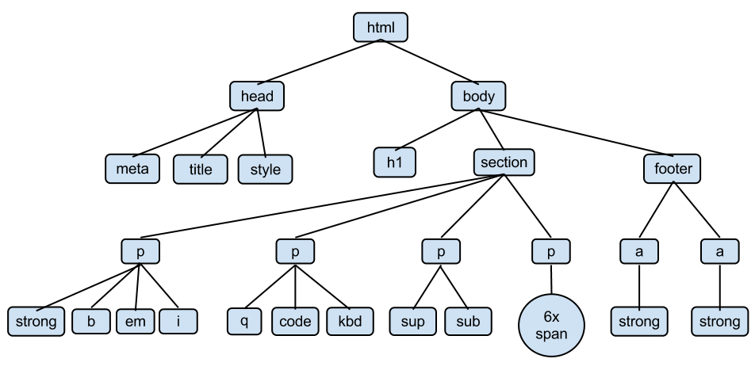

## 변수

|  키워드  | 중복선언 | 재할당 |             비고             |
|:-----:|:----:|:---:|:--------------------------:|
|  var  |  O   |  O  |          ES6부터 안씀          |
|  let  |  X   |  O  |                            |
| const |  X   |  X  | Reference 타입은 내부 속성 변경 가능  |

## scope & hoisting

|    키워드     | 유효한 참조 범위  |                호이스팅                |
|:----------:|:----------:|:----------------------------------:|
|    var     | 함수 레벨 스코프  |       호이스팅 후 undefined로 초기화됨       |
| let, const | 블록 레벨 스코프  | 호이스팅은 되나 undefined 초기화를 안해줌 -> `에러남` |

```javascript
function func() {
    if (true) {
        var a = 'a';
        console.log(a); // 잠초 가능
    }
    console.log(a); // 참조 가능 
}
console.log(a); // 참조 불가능
func();
```

```javascript
function func() {
    // if 블럭임
    if (true) {
        let a = 'a';
        const b = 'b';
        console.log(a); // 참조 가능
        console.log(b); // 참조 가능
    }
    console.log(a); // 참조 불가능
    console.log(b); // 참조 불가능
}
func();
```

- 함수는 호이스팅이 됨
    ```javascript
    func();
  
    function func() {
        console.log('Hello world'); 
    }
    ```

## HTML을 이용한 화면 구성 및 관리

브라우저는 html의 요소를 분석하여 화면을 그려준다. 
이러한 과정을 `중요 렌더링 경로, CRP(Critical Rendering Path)`라고 한다.

### Window

- 브라우저에 의해 만들어지는 `global 객체`이며, `웹 브라우저 창`을 나타냄.
- `window` 객체에 들어있는 객체들을 `BOM(Browser Object Model)` 이라고 함.
  - `window.location`, `window.navigator`, `window.history` 등
- [예시 코드](16_window.html)

### DOM (Document Object Model)

- `window.document` 객체를 말하며, `내부의 컨텐츠`를 나타냄.
- DOM tree 예시
  
- 개발자가 js 코드로 DOM을 조작하여 기능을 동작하는 것임.
  ```javascript
  var button = document.querySelector('.button'); // button 이라는 이름을 가진 요소 접근
  button.onclick = function() {
      this.style.backgroudColor = "red"; // 요소 스타일 변경
  };
  ```
- [예시 코드](17_dom.html)

### DOM EventListener

DOM 요소에 이벤트(e.g. 클릭 등)가 발생했을 때 작업을 추가하는 방법들은 아래와 같다.

1. 자바스크립트 코드에서 프로퍼티로 등록
```javascript
// 문서가 load 될 때 이 함수를 실행
window.onload = function () {
    // 아이디가 "text"인 요소를 return
    let text = document.getElementById("text");
    text.innerHTML = "HTML 문서 loaded";
}
```

2. HTML 태그에 속성으로 등록
```html
<button onclick="alert('버튼이 클릭되었습니다')">버튼입니다.</button>
```

3. addEventListener 메서드 사용
`element.addEventListener(이벤트명, 실행할 함수명(listener), 옵션);`
```javascript
const aElement = document.querySelector('a');
aElement.addEventListener('click', () => {
    alert('a element clicked');
});
```

### Event 종류

1. UI 이벤트 
   - load: 페이지나 리소스(이미지 등)가 완전히 로드되었을 때 발생. 
   - unload: 페이지가 종료되거나 닫힐 때 발생.
   - resize: 창 크기가 변경될 때 발생. 
   - scroll: 요소나 창이 스크롤될 때 발생. 
   - beforeunload: 사용자가 페이지를 떠나기 직전에 발생(경고 메시지 표시 가능).
2. 키보드 이벤트 
   - keydown: 키가 눌릴 때 발생 (키가 눌린 상태 유지 시 반복 발생 가능). 
   - keypress: 키가 눌려 문자 입력이 발생할 때 (단, 기능 키는 제외). 참고: 이 이벤트는 deprecated 상태로, 최신 코드에서는 권장되지 않음. 
   - keyup: 키가 떼어질 때 발생.
3. 마우스 이벤트
   - click: 마우스 버튼을 누르고 뗄 때 발생.
   - dblclick: 마우스를 더블클릭할 때 발생.
   - mousedown: 마우스 버튼이 눌릴 때 발생.
   - mouseup: 마우스 버튼이 떼어질 때 발생.
   - mousemove: 마우스가 요소 위에서 움직일 때 발생.
   - mouseover: 마우스가 요소 위로 들어갈 때 발생.
   - mouseout: 마우스가 요소를 벗어날 때 발생.
   - mouseenter: 마우스가 요소 내부로 들어갈 때 발생 (mouseover와 달리 버블링 없음).
   - mouseleave: 마우스가 요소를 떠날 때 발생 (mouseout와 달리 버블링 없음).
   - contextmenu: 마우스 오른쪽 버튼 클릭으로 컨텍스트 메뉴가 열릴 때 발생.
4. 포커스 이벤트
   - focus: 요소가 포커스를 받을 때 발생.
   - blur: 요소가 포커스를 잃을 때 발생.
   - focusin: 요소가 포커스를 받기 직전에 발생 (버블링 지원).
   - focusout: 요소가 포커스를 잃기 직전에 발생 (버블링 지원).
5. 폼 이벤트
   - submit: 폼이 제출될 때 발생.
   - reset: 폼이 초기화될 때 발생.
   - change: 입력 요소의 값이 변경되고 포커스가 잃어질 때 발생 (예: 텍스트 입력 후 다른 곳 클릭).
   - input: 입력 요소의 값이 실시간으로 변경될 때 발생 (예: 키 입력마다 발생).
   - select: 텍스트가 선택될 때 발생 (텍스트 필드에서 드래그로 선택 시).
   - invalid: 폼 요소가 유효성 검사에 실패할 때 발생.

이 외에도 다양함.