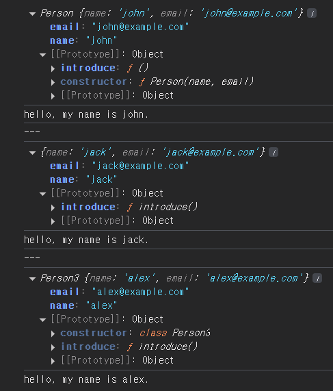

## 객체 생성

### 1. 생성자 함수 사용
```javascript
function Person(name, email) {
    this.name = name;
    this.email = email;
}

Person.prototype.introduce = function () {
    return `hello, my name is ${this.name}.`;
}

const john = new Person('john', 'john@example.com');
console.log(john);
console.log(john.introduce());
console.log('---');
```

### 2. prototype 관리
`Object.create(prototype)`을 사용해서 해당 prototype을 가진 객체를 생성

```javascript
const person2Prototype = {
    introduce() {
        return `hello, my name is ${this.name}.`;
    }
}
function Person2(name, email) {
    const person = Object.create(person2Prototype);
    person.name = name;
    person.email = email;
    return person;
}

const jack = new Person2('jack', 'jack@example.com');
console.log(jack);
console.log(jack.introduce());
console.log('---');
```

### 3. 클래스 사용
```javascript
class Person3 {
    name;
    email;

    // constructor는 인스턴스 생성과 동시에 클래스 필드의 생성과 초기화 실행
    // new 키워드에 의해 호출됨
    // 생략 가능
    constructor(name, email) {
        this.name = name;
        this.email = email;
    }

    introduce() {
        return `hello, my name is ${this.name}.`;
    }
}

const alex = new Person3('alex', 'alex@example.com');
console.log(alex);
console.log(alex.introduce());
```

### 결과



## 언제 어떤 걸 써야 하나? (실용적 가이드)
### 간단한 객체 하나만 필요할 때
객체 리터럴(`const obj = { name: 'john' }`)도 괜찮지만, 반복 생성하려면 class 추천. 
### 여러 인스턴스 생성 + 메서드 공유
class 사용(예제 3). 유지보수와 가독성 면에서 최적. 
### 레거시 코드 작업
생성자 함수(예제 1)로 호환성 유지. 
### 프로토타입 실험
Object.create(예제 2)로 상속 구조를 세밀히 다룰 때.