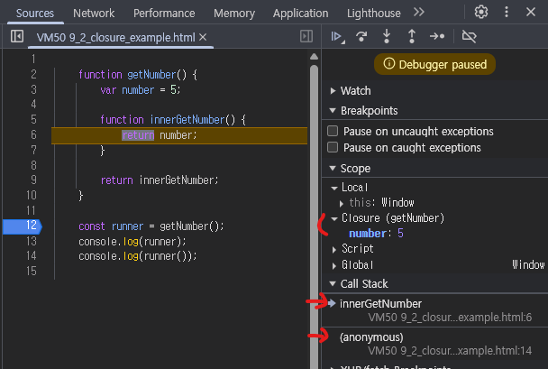

# Closure

- [9_1_closure.js](9_1_closure.js)
- [9_2_closure_example.html](9_2_closure_example.html)

---

## 상황

- `getNumber()` Call Stack은 이미 사라졌는데 `runner()`가 실행될 때 하위 함수가 나중에 실행됨

## 용도

1. 데이터 캐싱
2. 정보 은닉