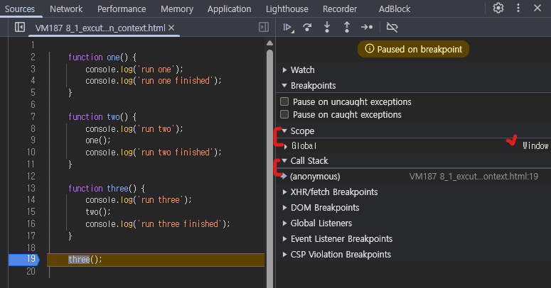
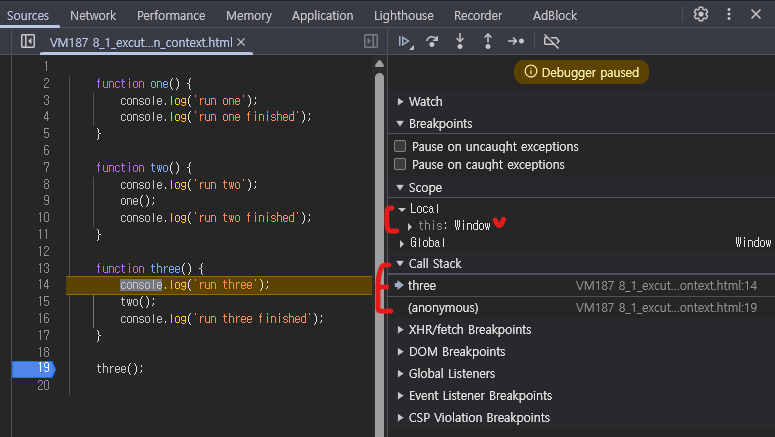
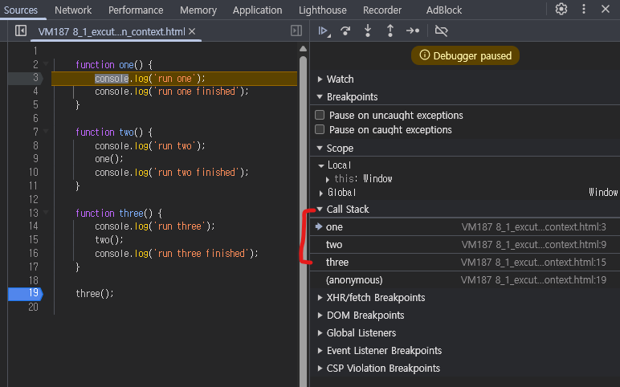
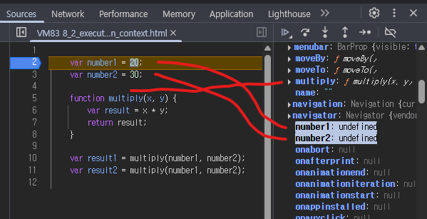

# Execution Context

- [8_1_execution_context.html](8_1_execution_context.html)
- [8_2_execution_context.html](8_2_execution_context.html)

---

## 개요

- 실행하려는 JS 코드와 코드가 실행할 때 필요한 정보를 담고있는 특수한 환경
- 즉, 코드 실행에 필요한 모든 데이터를 들고있는 환경

## Execution Context의 두 가지 타입

### 1. Global Context
- 최상위 Execution Context로, 코드를 실행하면 무조건 생성된다.
- 웹에서의 window 객체나 nodeJS에서 global 객체를 생성하고 들고있는다.

### 2. Function Context
- 함수가 실행될때마다 함수별로 실행되는 context
- 함수 실행에 대한 모든 정보를 가지고 있다.

##  Call Stack(Execution Context Stack) 동작 확인
- 코드
    ```javascript
    function one() {
        console.log('run one');
        console.log('run one finished');
    }
    
    function two() {
        console.log('run two');
        one();
        console.log('run two finished');
    }
    
    function three() {
        console.log('run three');
        two();
        console.log('run three finished');
    }
    
    three();
    ```

- 콘솔
    ```text
    run three
    run two
    run one
    run one finished
    run two finished
    run three finished
    ```
  
## Execution Context Stack의 2가지 Phase

### 1. Creation Phase

- Global Object를 생성한다. window 또는 global 객체가 생성되고 함수에서는 arguments 객체가 생성된다.
- this를 window 또는 global에 바인딩한다.
- 변수와 함수를 Memory Heap에 배정하고 기본값을 undefined로 저장한다.
  - [호이스팅](../1_basics/6_hoisting.js)이 일어나는 이유가, Creation Phase가 먼저 일어나기 때문에 변수와 함수를 메모리에 올리고 기본값을 설정하기 때문이다. 

### 2. Execution Phase

- 코드를 실행한다.
- 필요하다면 새로운 Execution Context를 생성한다.

## Web에서 Excution Context 테스트

- 실행할 코드: [8_1_excution_context.html](8_1_execution_context.html)

1. three에서 브레이크한 상태

   

   - web이기 때문에 global 객체에는 `Window`가 잡힘
   - Call Stack에 1개의 Execution Context가 생성됨 -> `Global Context`임

2. three 함수 안으로 들어간 상태

   

    - Call Stack에 three라는 함수가 하나 위에 추가됨 -> `Function Context`임

3. one까지 들어간 상태

    

    - 모든 함수가 Call Stack에 순서대로 올라간 상황

4. 다시 나오면 one부터 순서대로 없어짐

## Web에서 Creation Phase 확인



- `var number1 = 20;`이 실행되기 전에 이미 global scope에 변수들이 힙 메모리 할당을 받은 후 undefined로 초기화 되어 있다.
- `multiply()` 함수도 마찬가지 상태