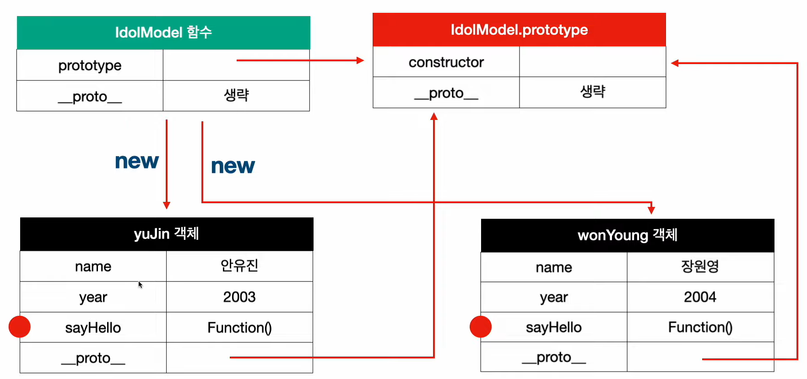
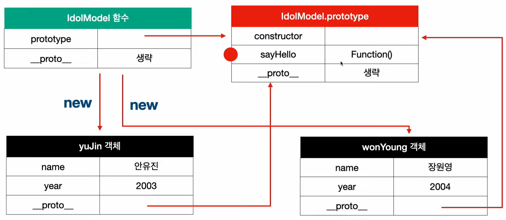

# Prototype Chain

- [5_1_prototype_chain.js](5_1_prototype_chain.js)
- [5_2_prototype_chain.js](5_2_prototype_chain.js)
- [5_3_prototype_chain.js](5_3_prototype_chain.js)

---

> javascript에서 
> 1) 함수는 객체임
> 2) 클래스는 생성자 함수임
> 3) 그러므로 클래스는 객체임

- `{function}.prototype` 함수 객체가 가지는 속성이자, 객체임
- `{instance}.__proto__` 모든 javascript 객체는 해당 속성으로 자신의 부모(=생성자)의 `prototype` 과 연결됨

> Person (생성자 함수) <br>
> &nbsp;&nbsp;&nbsp;&nbsp;└── prototype (객체) ← "부모" 역할 <br>
> &nbsp;&nbsp;&nbsp;&nbsp;&nbsp;&nbsp;&nbsp;&nbsp;└── p (인스턴스) → p.__proto__가 Person.prototype을 가리킴

## 코드 예시

```javascript
function IdolModel2(name, year) {
    this.name = name;
    this.year = year;
    this.sayHello = function() {
        return `${this.name}이 인사를 합니다.`;
    }
}

const yuJin2 = new IdolModel2('안유진', 2003);
const wonYoung2 = new IdolModel2('장원영', 2004);

console.log(yuJin2.sayHello());
console.log(wonYoung2.sayHello());
console.log(yuJin2.sayHello === wonYoung2.sayHello); // false --> 다른 메모리 공간을 점유한다는 뜻
console.log(yuJin2.hasOwnProperty('sayHello')); // true -> 상속 받은게 아니라는 뜻
```



- `yuJin2.__proto__` -> `IdolModel.prototype` -> `Object.prototype` -> `null`
- `wonYoung2.__proto__` -> `IdolModel.prototype` -> `Object.prototype` -> `null`

```javascript
function IdolModel3(name, year) {
    this.name = name;
    this.year = year;
}

IdolModel3.prototype.sayHello = function() {
    return `${this.name}이 인사를 합니다.`;
}

const yuJin3 = new IdolModel3('안유진', 2003);
const wonYoung3 = new IdolModel3('장원영', 2004);

console.log(yuJin3.sayHello());
console.log(wonYoung3.sayHello());
console.log(yuJin3.sayHello === wonYoung3.sayHello); // true --> 같은 메모리 공간을 점유한다는 뜻
console.log(yuJin3.hasOwnProperty('sayHello')); // false -> 상속 받았다는 뜻
```



## prototype으로 놀아보자

- [코딩애플](https://youtu.be/wUgmzvExL_E?si=ZE1FiPCP0Z48qImz)이 prototype을 유전자라고 생각하라고 했음.
- [우테코](https://youtu.be/RYxgNZW3wl0?si=dcThNSHBNeZ3-Ted)에서 prototype은 내가 주로 비유하며 생각했던 java의 Class 및 상속, Override와는 개념이 다른것임을 알게됨.

## prototype을 