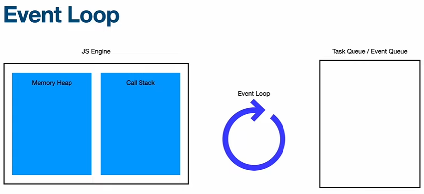
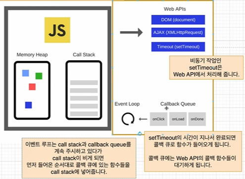
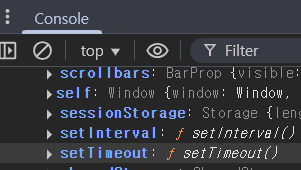

# Event Loop

---

- [이벤트 루프의 동작을 눈으로 볼 수 있는 사이트1](https://kamronbekshodmonov.github.io/JELoop-Visualizer/)
- [이벤트 루프의 동작을 눈으로 볼 수 있는 사이트2](https://latentflip.com/loupe)



- javascript 런타임 환경이 실행되면 Event Loop가 생성된다.
- javascript 런타입에서는 싱글 스레드로 `힙 메모리`와 `스택 영역`이 할당된다.

## Event Loop 동작 순서

### 예제 코드

    ```javascript
    function asyncLongWork() {
        // `setTimeout(handler, timeout)` timeout milliseconds 후에 handler 함수를 비동기로 실행하는 함수
        setTimeout(() => {
            console.log('완료');
        }, 2000);
    }
    
    console.log('Hello');
    asyncLongWork();
    console.log('World');
    ```

### 동작 순서



1. `console.log('Hello')`가 Call Stack에 들어가 실행되고 "Hello"를 출력한 뒤 스택에서 제거된다.
2. `asyncLongWork()`가 Call Stack에 들어간다. 그 안에서 `setTimeout(() => console.log('완료'), 2000)`이 실행되며
3. setTimeout은 브라우저의 타이머 모듈(Node.js 환경이면 libuv라는 C 라이브러리)에 콜백 `() => console.log('완료')`과 2000ms를 등록한다.
4. setTimeout 호출 자체는 즉시 끝나고, `asyncLongWork()`는 더 할 일이 없어 Call Stack에서 제거된다.
5. `console.log('World')`가 Call Stack에 들어가 실행되고 "World"를 출력한 뒤 스택에서 제거된다. (이 시점에서 Call Stack이 비어 있음)
6. 2초 후, 타이머가 끝나면 `() => console.log('완료')` 콜백이 Task Queue에 추가된다. 
7. 이벤트 루프가 현재 실행중인 동기 스크립트가 완전히 끝난 후 Call Stack이 비어 있는 걸 확인하고, Task Queue에서 콜백을 꺼내 Call Stack에 넣는다.
8. `console.log('완료')`가 실행되어 "완료"를 출력하고, Call Stack에서 제거된다.

- window 객체에 .setTimeout() 함수가 있음
  
- node.js 에도 global 객체에 함수가 있음
  ```shell
  PS C:\Users\black> node
  Welcome to Node.js v16.20.1.
  Type ".help" for more information.
    > global
  <ref *1> Object [global] {
    global: [Circular *1],
    clearInterval: [Function: clearInterval],
    clearTimeout: [Function: clearTimeout],
    setInterval: [Function: setInterval],
    setTimeout: [Function: setTimeout] {
      [Symbol(nodejs.util.promisify.custom)]: [Getter]
    },
    queueMicrotask: [Function: queueMicrotask],
    performance: Performance {
      nodeTiming: PerformanceNodeTiming {
        name: 'node',
        entryType: 'node',
        startTime: 0,
        duration: 2756.109899997711,
        nodeStart: 0.4659000635147095,
        v8Start: 2.9903000593185425,
        bootstrapComplete: 21.101199984550476,
        environment: 10.393800020217896,
        loopStart: 38.8503999710083,
        loopExit: -1,
        idleTime: 2677.7706
      },
      timeOrigin: 1742795374629.817
    },
    clearImmediate: [Function: clearImmediate],
    setImmediate: [Function: setImmediate] {
      [Symbol(nodejs.util.promisify.custom)]: [Getter]
    }
  }
  ```

### 생겼던 의문

Call Stack이 비는 순간 Event Loop가 Call Stack이 비어있는 것을 확인하고 Task Queue에 있는 함수를 FIFO로 가져와 실행한다고 하는데, 
그렇다면 메인 스레드가 코드를 실행중에 순간적으로 Call Stack이 비어있을 때 Task Queue에 작업이 3개가 들어와 있다면, 작업 3개를 모두 다 처리하고 다시 처리하던 코드를 처리하는 것일까? 우선순위는 어떻게 되는 것일까?

- 의문의 예제 코드

    ```javascript
    console.log('Start');
    
    setTimeout(() => console.log('Timeout 1'), 0);
    setTimeout(() => console.log('Timeout 2'), 0);
    setTimeout(() => console.log('Timeout 3'), 0);
    
    console.log('Middle');
    
    for (let i = 0; i < 3; i++) {
        console.log(`Loop ${i}`);
    }
    
    console.log('End');
    ```
  
- 콘솔 출력

    ```text
    Start
    Middle
    Loop 0
    Loop 1
    Loop 2
    End
    Timeout 1
    Timeout 2
    Timeout 3
    ```
    - 동작 결과를 보니, `Task Queue`의 작업은 모든 코드가 처리된 후 동작한다.

> 왜 `console.log('Middle');` 이 끝난 후 Call Stack에 아무것도 없는 순간에 `Task Queue`에서 작업을 꺼내오지 않는 것인가?

> 답변: 정확하게는 Call Stack에 아무것도 없는 상황이 아니라 `Execution Context`이 끝나는 상황에 `Task Queue`에서 꺼내온다!
> > **[Execution Context](../3_all_about_object/ExecutionContext.md)의 범위는?** <br>
> > `Web 환경`에서는 `<script></script>` 범위 하나 또는 이벤트 핸들러 하나 <br>
> > `Node.js 환경`에서는 `.js` 파일 실행 또는 `REPL` 한 줄 <br>

[위키독스 참고](https://wikidocs.net/158524)